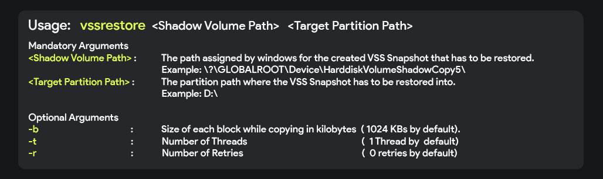
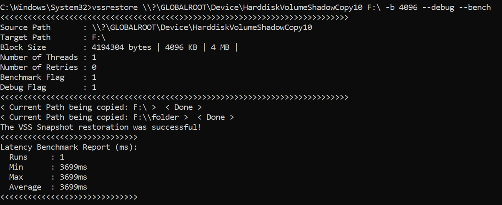

## Fast Block-Based VSS Snapshot restore utility

## Build Dependencies 
- Visual Studio 2022 Community Edition : Windows SDK

  
## How to run the CLI application?
1. Copy the console application from the **vss-snapshot-restore-utility\vssrestore\x64\Release\vssrestore.exe** and paste it somewhere in a folder in your drive.

2. Set the environment variable : Copy the path of the above folder into the PATH environment variable.
> Start Search -> Edit the System Environment Variables -> Environment Variables -> Path

3. After setting the environment variable, the utility can be directly used from the command prompt as follows
> vssrestore <shadow_volume_path> <target_partition_path>

- Optional Parameters:
-    -b        Specify the block size        (By default: 1024 kilobytes (1MB))
-    --bench   To measure copy time          (in Milliseconds)
-    --debug   To display inputs being used
-  Ex: vssrestore \\?\GLOBALROOT\Device\HarddiskVolumeShadowCopy10 F:\ -b 1024 --bench --debug
#### Screengrab

### How to create a VSS Snapshot of a given drive?
- Open Command prompt with Admin privileges
- Type the below command and hit enter ( Replace the drive letter with that of the drive whose VSS Snapshot has to be created )
 
> powershell.exe -Command (gwmi -list win32_shadowcopy).Create('E:\','ClientAccessible')

### How to get the Shadow Copy Path of the created VSS Snapshot?
- Open Command prompt with Admin privileges
- Type the below command to list all the VSS Snapshots 
vssadmin list shadows
- In that find the  **Shadow Copy Volume** field which will be the required path.
>  Ex:  \\?\GLOBALROOT\Device\HarddiskVolumeShadowCopy10

## Testing
### VSS Restoration Benchmark
#### Test Setup:
- Build and Test OS: 
    Edition	Windows 11 Home Single Language
    Version	24H2
    OS build	26100.4061
    Experience	Windows Feature Experience Pack 1000.26100.84.0

- VSS Snapshot Used of :  E:\ Drive of 10GBs (NTFS) with file.bin binary file of 2.53GB and a folder called folder with the same binary file.
- Files and Folders : E:\file.bin
                      E:\folder\file.bin
                      Total Size: 5.07 GB
- Drive Used: NVMe SSD Samsung
- Target Drive:  F:\ Drive of 10GBs (NTFS) Empty
#### Benchmark for various blocksizes

|SL. no. | Blocksize | Latency for restoration |
| -- | -- | -- |
| 1. | 1KB | 16074 ms (16.074 seconds) |
| 2. | 64KB | 5920 ms (5.920 seconds) |
| 3. | 128KB | 4796 ms (4.796 seconds) |
| 4. | 512KB | 4107 ms (4.107 seconds) |
| 5. | 1024KB | 4241 ms (4.241 seconds) |
| 6. | 2048KB | 3880 ms (3.880 seconds) |
| 7. | 4096KB | 3699ms (3.699 seconds) |
| 8. | 8192KB | 3837ms (3.837 seconds) |
| 9. | 16384 | 5488 ms (5.488 seconds) |

